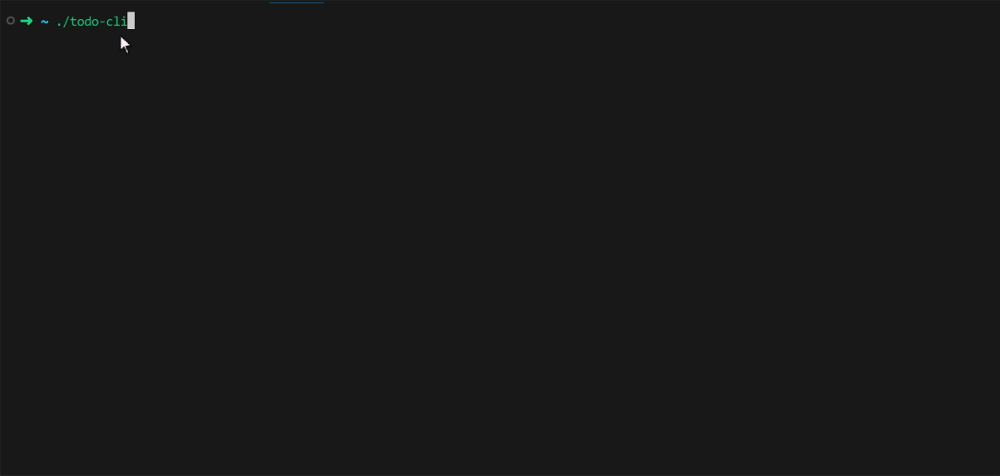

# TODO-CLI




This is a lightweight command-line to-do application built with Go. It enables you to effortlessly add, view, update, and remove tasks, storing them in a local JSON file for easy access and management.

## Commands

1. `add`      command :- To add new tasks.
2. `list`     command :- To list all the existing tasks.
3. `delete`   command :- To delete existing tasks.
4. `complete` command :- To mark a task as completed


## Usage

1. Clone the repository

```
git clone https://github.com/ayush3160/todo-cli.git
```

2. Run Commands

```
go run main.go list
```